# Portfolio con Django 
Más que un portafolio se trata de una práctica en la que tuve que elaborar un sitio web sobre las distintas materias del primer curso de DAW.

Hice el sitio web en python con Django.

La lógica principal consta de categorías en las que hay artículos que hablan sobre una materia. Siendo cada categoría una materia del curso.

Además con el buscador puedes buscar artículos de cualquier categoría.

## Vistas del sitio web:
**Inicio**
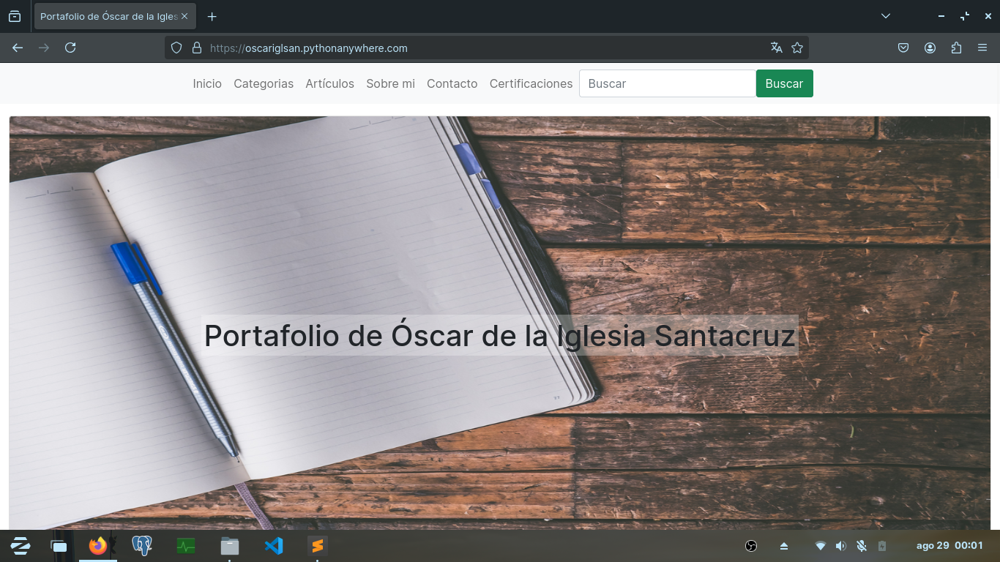
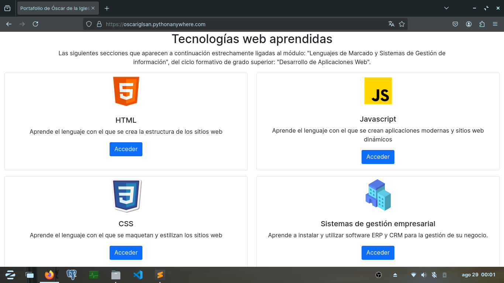

**Categorías**
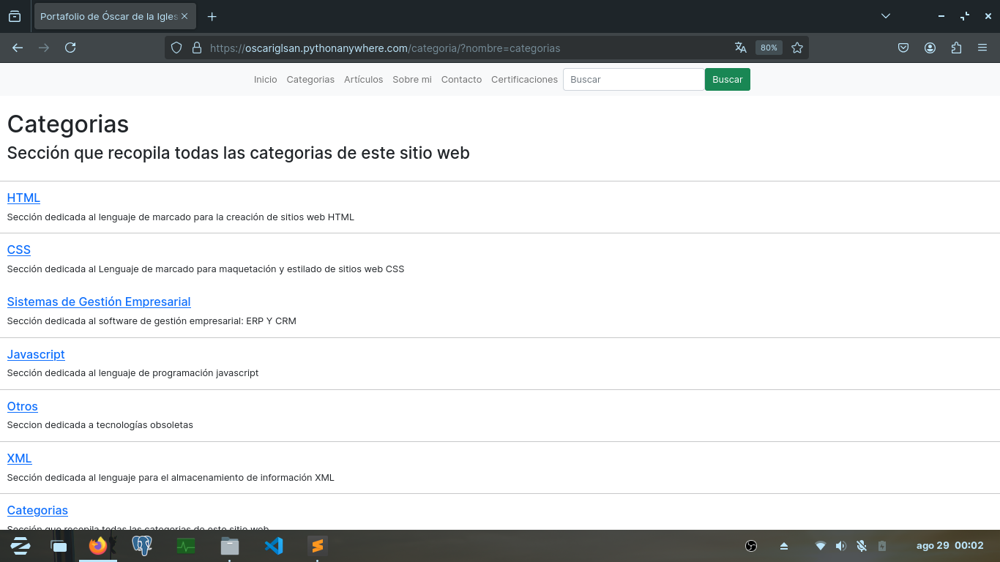

**Artículos**
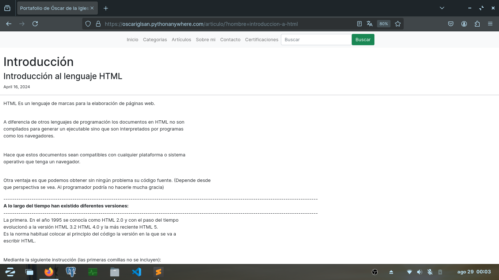

**Certificados**
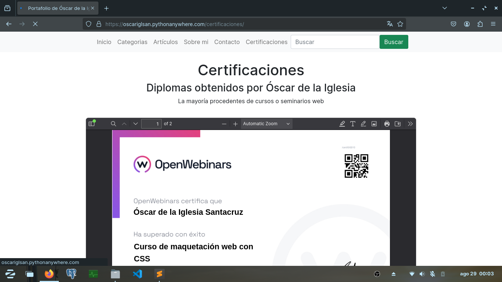

**Contacto**
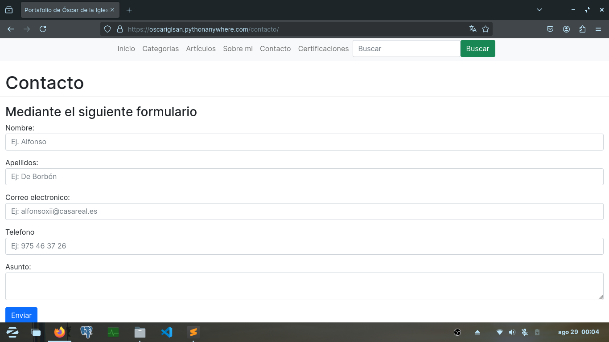

**Ejemplo de artículo completo**

**Uso de la búsqueda**
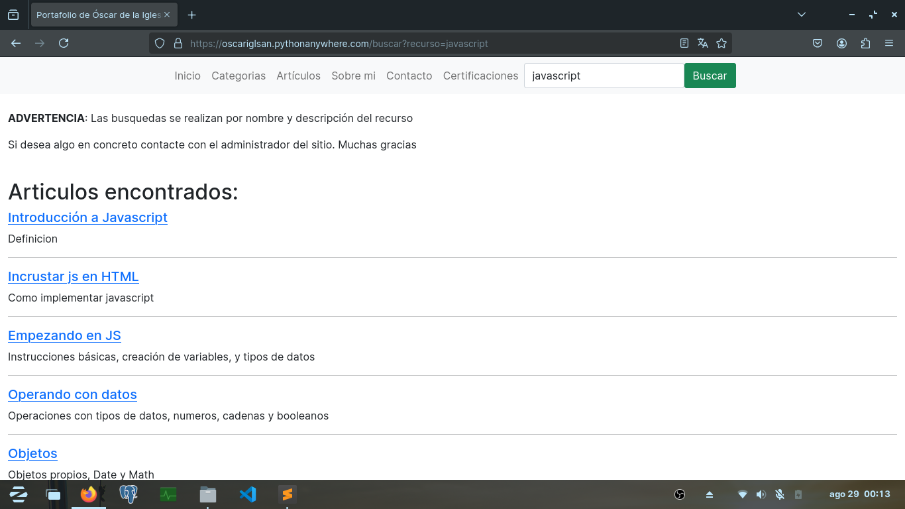

## URL del sitio:
https://oscariglsan.pythonanywhere.com

## Muestras del código:

**urls.py**
Archivo donde se especifica que vista, endpoint... etc corresponde a cada url
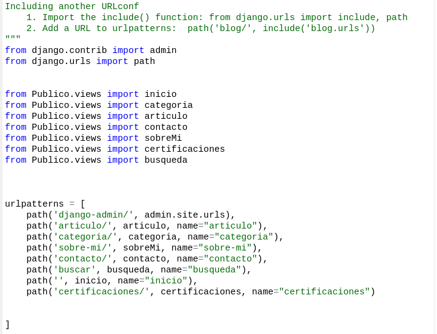

**models.py - ORM de Django**
Especifico que tablas y columnas debe tener la BBDD mediante clases y atributos.
En este caso tengo las clases: Usuario, Categoria y Articulo.
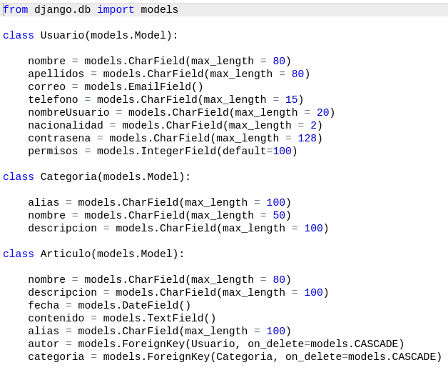

**views.py**
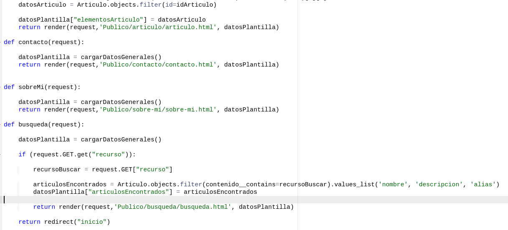

**plantilla: categorías**
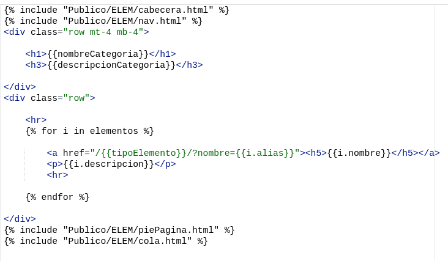

**plantilla: búsqueda**
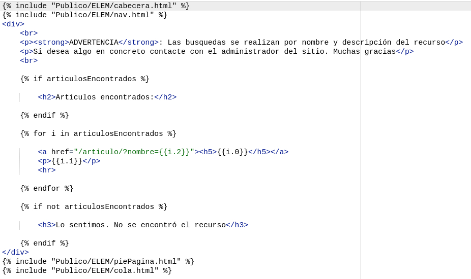

**settings.py**
En producción la bandera debug debe ser False, e importante incluir la app django en la lista INSTALLED_APPS
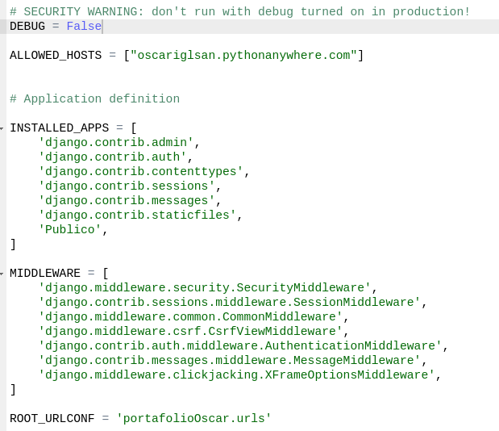

